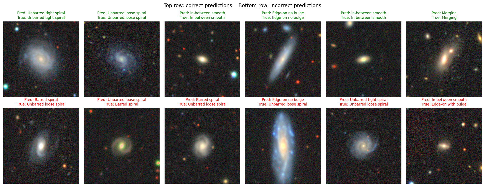
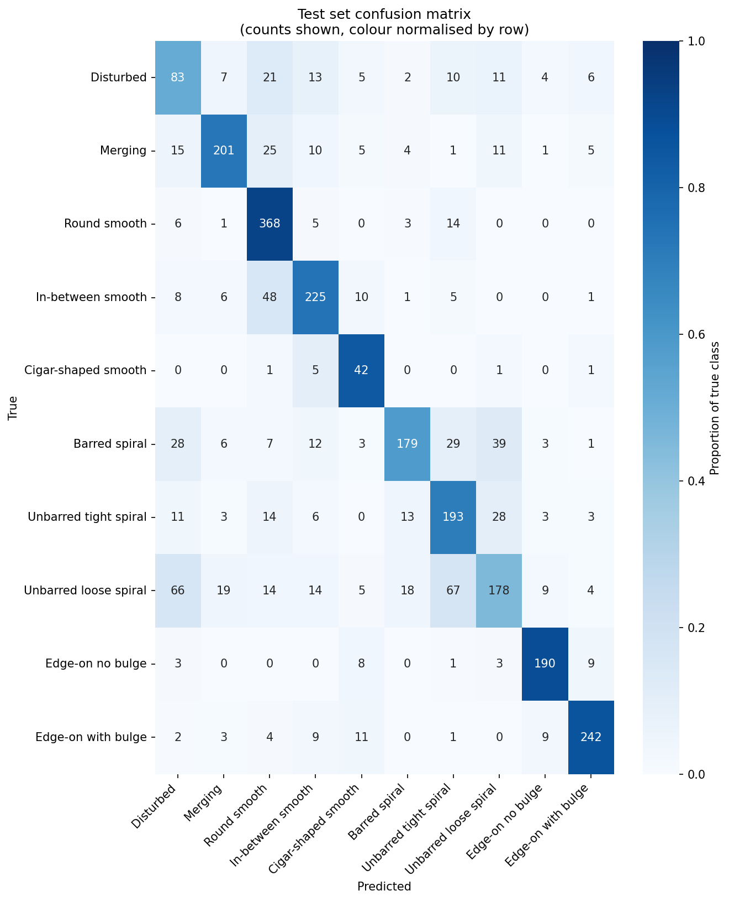

# Galaxy Morphology Classifier

A PyTorch CNN that classifies galaxy images into 10 morphological categories using transfer learning from a pretrained ResNet50. Trained on the Galaxy10 DECaLS benchmark dataset and deployed as a containerised Gradio app on Hugging Face Spaces.

**[Live demo on Hugging Face Spaces](https://huggingface.co/spaces/arctxrus/galaxy-morphology-classifier)**



## Results

Headline metrics on the held-out test set (2,661 images):

| Metric | Value |
| --- | --- |
| Accuracy | 0.714 |
| Balanced accuracy | 0.723 |
| Macro F1 | 0.699 |

Per class breakdown:

| Class | Precision | Recall | F1 | Test images |
| --- | --- | --- | --- | --- |
| Disturbed | 0.37 | 0.51 | 0.43 | 162 |
| Merging | 0.82 | 0.72 | 0.77 | 278 |
| Round smooth | 0.73 | 0.93 | 0.82 | 397 |
| In-between smooth | 0.75 | 0.74 | 0.75 | 304 |
| Cigar-shaped smooth | 0.47 | 0.84 | 0.60 | 50 |
| Barred spiral | 0.81 | 0.58 | 0.68 | 307 |
| Unbarred tight spiral | 0.60 | 0.70 | 0.65 | 274 |
| Unbarred loose spiral | 0.66 | 0.45 | 0.54 | 394 |
| Edge-on no bulge | 0.87 | 0.89 | 0.88 | 214 |
| Edge-on with bulge | 0.89 | 0.86 | 0.88 | 281 |



The edge-on classes are nearly solved because their elongated profile is geometrically distinctive. Cigar-shaped smooth achieves 84% recall despite only 334 training images, because the class weighting in the loss function compensates aggressively for its rarity. The weak points are unbarred loose spiral (faint arms get confused with several other classes) and disturbed (genuinely ambiguous labels with significant visual overlap with mergers and faint spirals).

## The dataset

[Galaxy10 DECaLS](https://astronn.readthedocs.io/en/latest/galaxy10.html) is a benchmark dataset of 17,736 galaxy images at 256x256 resolution, with one of 10 morphological class labels per image. The labels come from Galaxy Zoo volunteer classifications, filtered to require at least 55% agreement between annotators.

The 10 classes:

0. Disturbed
1. Merging
2. Round smooth
3. In-between round smooth
4. Cigar-shaped smooth
5. Barred spiral
6. Unbarred tight spiral
7. Unbarred loose spiral
8. Edge-on without bulge
9. Edge-on with bulge

The dataset is meaningfully imbalanced. Round smooth makes up 14.9% of the images, while cigar-shaped smooth is only 1.9%. This shapes both evaluation (macro F1 is more informative than accuracy) and training (class weighting is essential, otherwise the model favours the dominant classes).

## Methodology

### Data pipeline

Stratified 70/15/15 train/val/test split, saved to `data/splits.csv` and committed to the repo so every training run uses the exact same partition. This eliminates any possibility of accidentally re-splitting between runs and contaminating the test set.

The PyTorch Dataset opens the HDF5 file lazily on first access in `__getitem__`, with `__getstate__` overridden to drop the file handle before pickling. This is required for multi worker DataLoaders on Windows, where worker processes use spawn rather than fork and the handle would otherwise fail to pickle. An optional preload path loads the full image array (~3 GB) into RAM at construction, removing disk I/O from the training inner loop.

### Augmentations

Galaxies have no preferred orientation in the sky, so the training pipeline applies rotations and flips in either direction:

- Training: random 224x224 crop from the 256x256 input, horizontal and vertical flips, random rotation up to 180 degrees, ImageNet normalisation.
- Evaluation: deterministic 224x224 centre crop, ImageNet normalisation.

ImageNet normalisation statistics are kept even though the galaxy pixel distribution differs from natural images, because the pretrained backbone expects inputs scaled this way.

### Model and training

ResNet50 with `IMAGENET1K_V2` torchvision weights, with the final 1000 class fully connected layer replaced by a fresh 10 way classifier head. Two stage training:

| Stage | Trainable parameters | Learning rate | Epochs |
| --- | --- | --- | --- |
| 1 (head only) | 20,490 | 1e-3 | 12 |
| 2 (layer4 + head) | 14,985,226 | 1e-4 | 8 |

Stage 1 brings the classifier head into a sensible region of weight space before any backbone parameters move; this acts as a warmup for the full network. Stage 2 unfreezes layer4 and fine tunes the high level features to the galaxy domain, while preserving the lower level texture and edge filters from ImageNet.

Loss: class weighted cross entropy. Weights are computed with sklearn's "balanced" formula on the training split only, never on val or test. Cigar-shaped smooth, the rarest class, carries a weight of 5.3.

Optimiser: Adam at the stated learning rate per stage.

### Tuning experiment

One controlled tuning experiment was run after the baseline finished:

| Run | Stage 2 LR | Stage 2 epochs | Best val macro F1 |
| --- | --- | --- | --- |
| A (selected) | 1e-4 | 8 | **0.705** |
| B (alternative) | 5e-5 | 12 | 0.693 |

The lower learning rate (run B) produced a smoother, more monotonic validation trajectory but did not catch up to run A within the epoch budget. Run A was selected as the final model.

## Limitations

This is an educational portfolio project. Honest limitations:

The Galaxy10 labels come from crowdsourced Galaxy Zoo classifications, which have measurable disagreement between human annotators for some class pairs. The most ambiguous boundaries in practice are round smooth versus in-between round smooth, and the spiral subtypes (tight versus loose, barred versus unbarred). The 55% volunteer agreement threshold built into the dataset helps but does not eliminate the noise floor.

The cigar-shaped smooth class has only 50 test images, so per class metrics there are noisy and should not be over-interpreted.

The disturbed class is genuinely hard. F1 of 0.43 reflects real visual overlap with mergers, faint spirals, and image noise rather than a model failure. Human annotators also disagree on the boundaries of this class.

This model is not validated for production scientific use. Real morphology classification for research requires careful treatment of label noise, ensembling across multiple models, and human expert review.

## How to reproduce

Requirements: Python 3.11+, an NVIDIA GPU with CUDA 12.x for sensible training times, around 5 GB of disk space for the dataset and checkpoints.

```bash
git clone https://github.com/Arctxrus/galaxy-zoo-classifier.git
cd galaxy-zoo-classifier

python -m venv venv
venv\Scripts\activate           # Windows
# source venv/bin/activate      # Linux/macOS

pip install -r requirements.txt
```

Download the dataset (~2.5 GB) and create the stratified split:

```bash
python -c "import urllib.request, os; os.makedirs('data', exist_ok=True); urllib.request.urlretrieve('http://astro.utoronto.ca/~bovy/Galaxy10/Galaxy10_DECals.h5', 'data/Galaxy10_DECals.h5')"

python src/make_split.py
```

Train (about 45 minutes total on an RTX 3060 mobile):

```bash
python src/train.py --stage 1 --epochs 12 --lr 1e-3
python src/train.py --stage 2 --epochs 8 --lr 1e-4 --resume checkpoints/stage1_best.pt
```

Evaluate on the test set:

```bash
python src/evaluate.py --checkpoint checkpoints/stage2_best.pt
```

Run the Gradio app locally with Docker:

```bash
cd deploy
docker build -t galaxy-classifier .
docker run --rm -p 7860:7860 galaxy-classifier
```

## Project structure

```
galaxy-zoo-classifier/
├── data/
│   └── splits.csv               # committed split; dataset itself is gitignored
├── notebooks/
│   └── exploration.ipynb        # EDA, sample images, design notes
├── src/
│   ├── dataset.py               # PyTorch Dataset, multi-worker safe HDF5 reader
│   ├── model.py                 # ResNet50 builder and stage specific freezing
│   ├── train.py                 # Two stage training loop with CSV logging
│   ├── evaluate.py              # Test metrics, confusion matrix, examples
│   ├── transforms.py            # Train and eval transform pipelines
│   ├── make_split.py            # Stratified split builder (one off)
│   └── make_examples.py         # Extracts demo images for the Gradio app
├── deploy/
│   ├── app.py                   # Gradio interface
│   ├── Dockerfile               # CPU torch image for HF Spaces
│   ├── requirements.txt         # Inference only dependencies
│   ├── model.pt                 # Final trained checkpoint (95 MB)
│   ├── examples/                # One example image per class
│   └── README.md                # HF Spaces frontmatter and listing copy
├── assets/
│   ├── confusion_matrix.png
│   └── example_predictions.png
├── logs/
│   ├── training_log.csv         # Per epoch metrics across all runs
│   └── test_metrics.csv         # Final headline metrics
├── checkpoints/                 # gitignored
├── requirements.txt
└── .gitignore
```

## Tech stack

Python, PyTorch, torchvision, h5py, scikit-learn, pandas, matplotlib, seaborn, Gradio, Docker.

## Acknowledgements

- Galaxy10 DECaLS dataset: [astroNN](https://astronn.readthedocs.io/en/latest/galaxy10.html) by Henry Leung and Jo Bovy.
- DECaLS imagery: the [Dark Energy Camera Legacy Survey](https://www.legacysurvey.org/decamls/).
- Galaxy Zoo volunteer classifications: see the project at [zooniverse.org](https://www.zooniverse.org/projects/zookeeper/galaxy-zoo/).